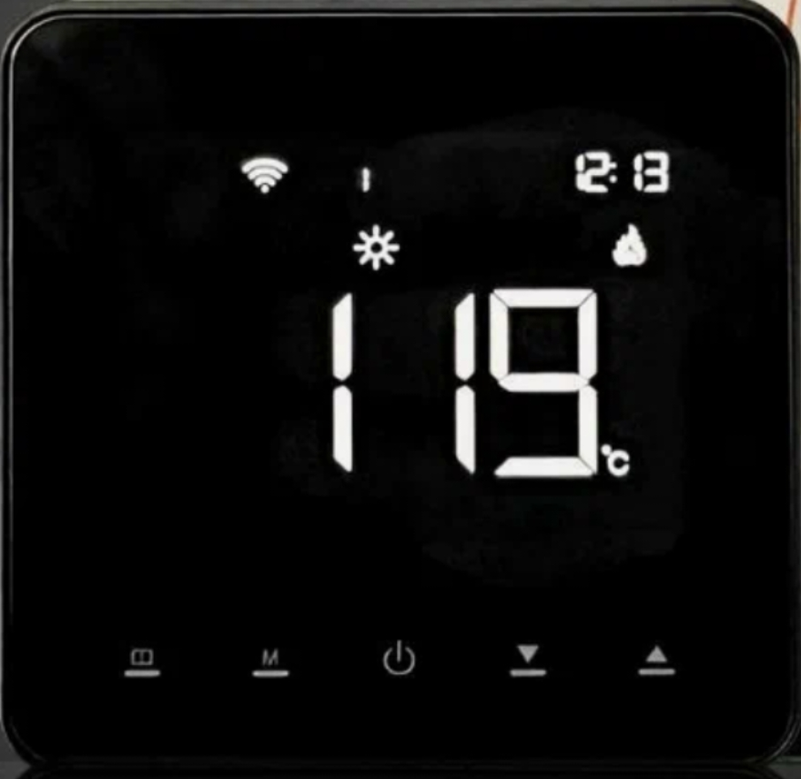

# AE-5503-S-H-ZIGBEE Sauna Thermostat — Zigbee2MQTT External Converter

Zigbee2MQTT external converter for a Tuya-based sauna thermostat sold under the
part number **AE-5503-S-H-ZIGBEE**, identified by Zigbee as:

- `modelID`: `TS0601`
- `manufacturerName`: `_TZE204_eaasry7v`

Out of the box this device pairs but exposes nothing usable: Zigbee2MQTT
recognizes the generic `TS0601` model but has no datapoint mapping for this
manufacturer variant, and without a matching converter Z2M can't complete the
Tuya MCU's time-sync handshake, so the device's Tuya cluster stays stuck
retrying `commandMcuSyncTime` and never reports real state.

## Usage

Copy `external_converters/AE-5503-S-H-ZIGBEE.js` into your Zigbee2MQTT data
directory's `external_converters/` folder (or paste it into the Z2M frontend's
external converter editor), restart Zigbee2MQTT, then **Reconfigure** the
device (or re-pair it) so the converter's handshake actually runs.

## Confirmed datapoints

| DP | Exposed as | Type | Access |
|----|------------|------|--------|
| 1  | `system_mode` (`heat`/`off`) | bool | read/write |
| 16 | `current_heating_setpoint` (0-120°C) | raw integer, unscaled | read/write |
| 24 | `local_temperature` | raw integer, unscaled | read only |
| 40 | `child_lock` | bool (LOCK/UNLOCK) | read/write |

All values are **unscaled raw integers** (no `divideBy10`), unlike many
sibling Tuya thermostat converters.

## Not yet mapped / future work

- Datapoints 44 (`local_temperature_calibration`) and 45 (`error`) are used by
  a closely related device family (`TS0601_thermostat_fancoil`,
  `_TZE200_xixlazkg`) with the same DP numbering for 1/16/24/40, but were
  **not verified** against this specific device and are deliberately left out.
- No timer/countdown, sound, or max-temperature-limit datapoints have been
  discovered — the physical unit may or may not expose these via other DPs.

## Discovery notes

Found by capturing raw Zigbee frames in Z2M debug logs while operating the
physical thermostat and decoding `manuSpecificTuya` `dataReport`/
`dataResponse` frames by hand. The key unblocking fix was enabling
`tuya.modernExtend.tuyaBase({dp: true, timeStart: '1970'})`, which completes
the Tuya MCU time-sync handshake that this device's firmware requires before
it will report any real datapoint values.
